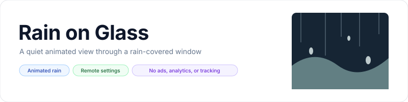
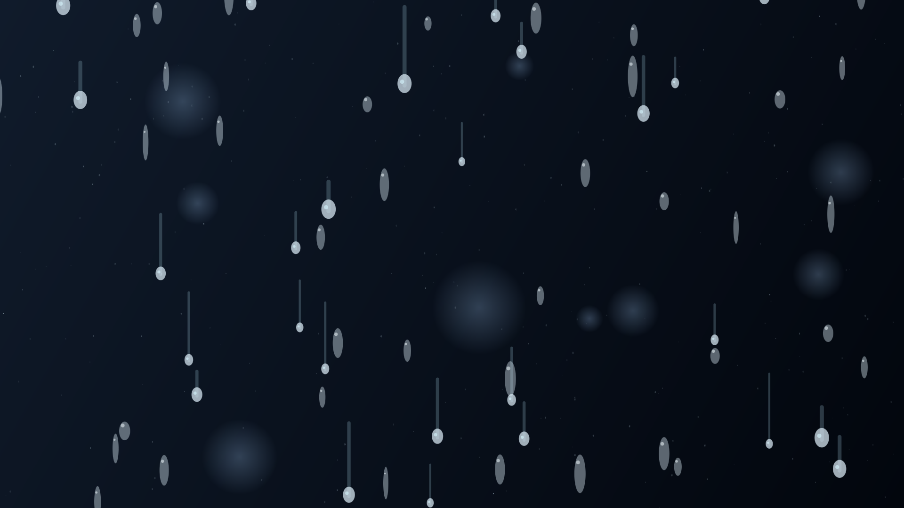
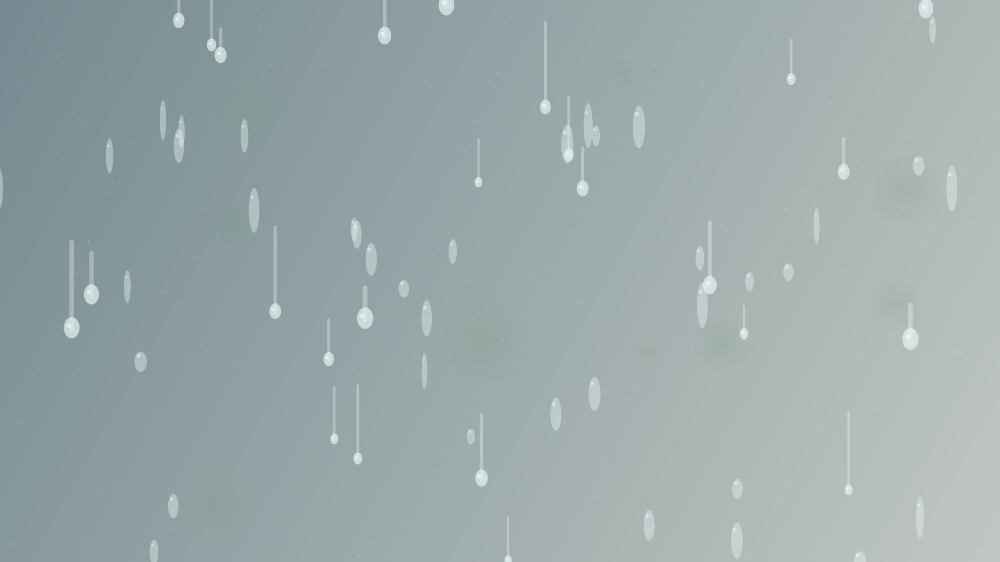
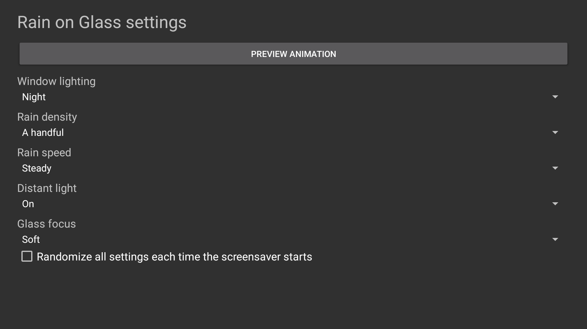

<p align="center">
    <picture>
        <source media="(prefers-color-scheme: dark)" srcset="art/banner-dark.svg">
        <source media="(prefers-color-scheme: light)" srcset="art/banner-light.svg">
        
    </picture>
</p>

<p align="center">An animated rain-on-glass screensaver for Fire TV, Android TV, and Google TV. No ads, analytics, or tracking.</p>

<p align="center">
  <a href="https://github.com/jeremykenedy/rain-on-glass/releases"></a>
  <a href="https://github.com/jeremykenedy/rain-on-glass/releases/latest"></a>
  <a href="https://github.com/jeremykenedy/rain-on-glass/actions/workflows/ci.yml"></a>
  <a href="https://github.com/jeremykenedy/rain-on-glass/actions/workflows/style.yml"></a>
  <a href="https://github.com/jeremykenedy/rain-on-glass/actions/workflows/docs.yml"></a>
  <a href="https://github.com/jeremykenedy/rain-on-glass/actions/workflows/security.yml"></a>
  <a href="LICENSE"></a>
  <a href="https://github.com/jeremykenedy"></a>
  <a href="https://github.com/jeremykenedy/rain-on-glass"></a>
  <a href="https://github.com/jeremykenedy/rain-on-glass/stargazers"></a>
  <a href="https://github.com/sponsors/jeremykenedy"></a>
</p>

Show some love by starring this repository on GitHub.

## Table of contents

- [Privacy](#privacy)
- [Features](#features)
- [Requirements](#requirements)
- [Installation](#installation)
- [Configuration](#configuration)
- [Screenshots](#screenshots)
- [Building and testing](#building-and-testing)
- [Documentation](#documentation)
- [License](#license)

## Privacy

The app requests no network permission and has no ads, analytics, telemetry, crash reporting, tracking, or runtime network requests. Settings stay on the device. The optional installer contacts GitHub only when you explicitly run install or update to download the published APK and checksum. It sends no device or usage information.

## Features

- Continuously animated rain beads and runoff trails over a softly lit, defocused background.
- Night or overcast background, five rain densities, three speeds, distant light, and soft or crisp glass focus.
- Each setting can be randomized independently, or all supported settings can be randomized when the screensaver starts.
- Remote-friendly settings and preview screens.
- Settings schema and values exposed through an app-owned content provider for host applications.
- Procedural, original visuals with no bundled stock footage or third-party artwork.

## Requirements

- Fire TV, Android TV, or Google TV with Android 6.0 (API 23) or newer and DreamService support.
- A computer with Python 3 and Android Debug Bridge (ADB) for CLI installation.
- Android SDK platform 36 and build-tools 36.0.0 to build from source.

The current release was verified on Android TV emulator-5570 (Google TV/Android TV system image, API and resolution in [verification notes](docs/VERIFICATION.md)). Fire TV and physical Google TV behavior have not been verified for this project.

## Installation

Connect the TV to ADB, then run the guided installer. It downloads the latest stable APK and checksum from this repository, verifies SHA-256, and installs or updates the app:

```bash
python3 install.py --serial TV_IP:5555
```

For scripts, add `--yes`. To install a locally built APK, add `--apk build/rain-on-glass.apk`. To remove the app, run `python3 install.py --serial TV_IP:5555 --uninstall` and confirm. Non-interactive uninstall requires `--uninstall --yes --force`.

After installation, choose Rain on Glass in the device's screensaver settings. The installer does not change the selected screensaver, system timers, or device update settings. See [installation](docs/INSTALLATION.md) for details.

## Configuration

Open Rain on Glass settings from the app list or the device's screensaver settings. Changes apply the next time the dream starts. Each choice includes Random; the master toggle randomizes all options at startup.

| Setting | Choices | Default |
|---|---|---|
| Window lighting | Night, Overcast, Random | Night |
| Rain density | A few, A handful, Many, Heavy, Downpour, Random | A handful |
| Rain speed | Slow, Steady, Fast, Random | Steady |
| Distant light | Off, On, Random | On |
| Glass focus | Soft, Crisp, Random | Soft |
| Randomize all | On, Off | Off |

Host applications can query `content://com.jeremykenedy.rainonglass.settings/schema` and `/settings`, then update an individual setting using the `key` and `value` columns at `/settings`. See [configuration](docs/CONFIGURATION.md).

## Screenshots

<table>
  <tr>
    <td></td>
    <td></td>
  </tr>
  <tr><td colspan="2"></td></tr>
</table>

The scene capture is from emulator-5570 after the animation started. It contains no app chrome, words, or watermark.

## Building and testing

```bash
bash build.sh
bash test.sh
bash scripts/test-coverage.sh
bash scripts/test-python-coverage.sh
bash scripts/check-style.sh
python3 scripts/check-docs.py
python3 scripts/check-privacy.py
```

Owned option resolution and settings validation have 100% line and branch coverage. Android framework lifecycle, graphics APIs, and system screensaver selection are validated separately on the emulator. Read [building](docs/BUILDING.md), [testing](docs/TESTING.md), and [CI](docs/CI.md).

## Documentation

- [Architecture](docs/ARCHITECTURE.md)
- [Building](docs/BUILDING.md)
- [CI](docs/CI.md)
- [Configuration](docs/CONFIGURATION.md)
- [Installation, update, and removal](docs/INSTALLATION.md)
- [Release process](docs/RELEASING.md)
- [Testing](docs/TESTING.md)
- [Troubleshooting](docs/TROUBLESHOOTING.md)
- [Device verification](docs/VERIFICATION.md)
- [v1.0.0 release notes](docs/releases/v1.0.0.md)

## License

Rain on Glass is licensed under the [Apache License 2.0](LICENSE). See [NOTICE](NOTICE) for project notices.
